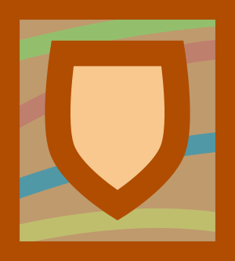
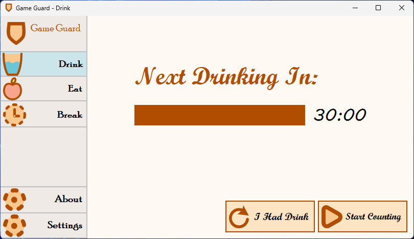
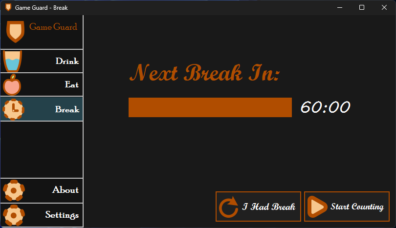
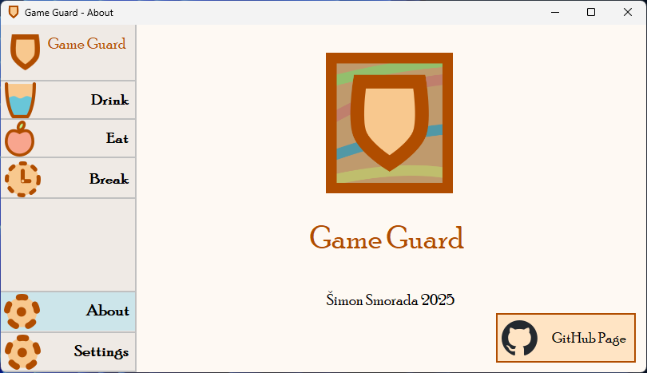
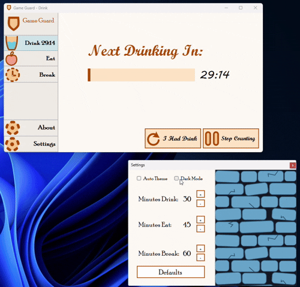
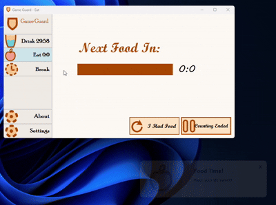

# Game Guard

Small, simple but powerful reminder of drinking water, eating food, or taking breaks when you work or game.

## Features

- 3 reminders for drinking, eating and taking breaks
- Clean and simple UI
- Easy To Navigate
- Light/dark mode toggle
## Installation

Download [Latest Version](https://github.com/ThreeDimensions1/GameGuard/releases) of Game Guard, extract .zip and run `GameGuard.exe`
## Demo

Insert gif or link to demo

|  |  |  |
|------------------------------|------------------------------|------------------------------|

## Gifs

|  |  |
|------------------------------|------------------------------|

## Building

To build Game Guard you will need VS 2022 (Tested on Windows 11)

- Open VS 2022
- Open GameGuard.sln project
- Set `Debug` to `Release`
- Click green button with `GameGuard` label
## Contributing

Contributions are always welcome!
## Feedback

If you have any feedback, ideas or bugs, open a new tab in Issues.

## Requirements

- .NET 6.0

- Windows 7 or heigher
